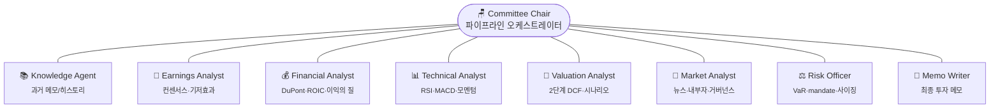
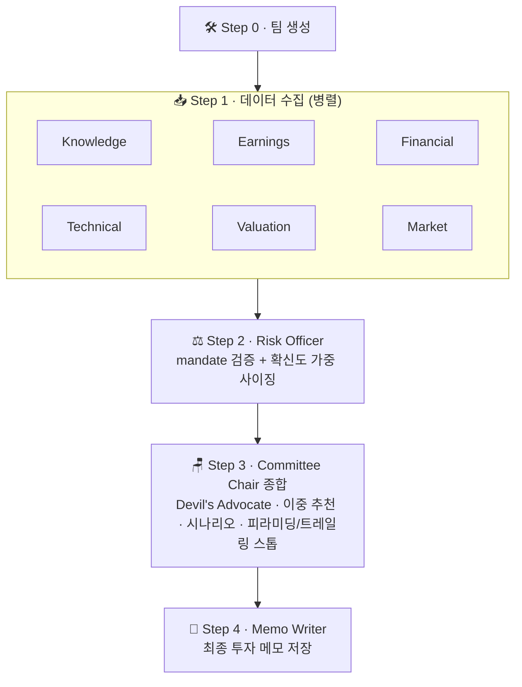

<div align="center">

# 📈 Investment Agent Team

### Claude Code Agent Teams 기반 멀티 에이전트 투자 분석 시스템

**8명의 전문 에이전트 + Committee Chair**가 협업하여 종합 투자 판단을 수행합니다.<br/>
자금이 몰리는 **메가트렌드 종목**에 대해 손절 규율 기반의 과감한 집중·모멘텀 베팅을 지원합니다.

<br/>


</div>

> [!WARNING]
> 모든 분석은 **참고 자료**이며 투자 권유가 아닙니다. 투자 판단과 그 결과의 책임은 전적으로 이용자 본인에게 있습니다.

---

## 📑 목차

- [투자 철학](#투자-철학)
- [아키텍처](#아키텍처)
- [설치](#설치)
- [사용법](#사용법)
- [Mandate 프로파일](#mandate-프로파일)
- [분석 모듈](#분석-모듈)
- [에이전트 구성](#에이전트-구성)
- [파이프라인 흐름](#파이프라인-흐름)
- [프로젝트 구조](#프로젝트-구조)
- [주요 특징](#주요-특징)

---

## 투자 철학

보수적 분산 일변도가 아니라, 자금이 몰리는 **메가트렌드·강한 서사 종목**에 대해서는 **손절 규율 기반의 과감한 집중·모멘텀 베팅**을 허용합니다. 페르소나는 20년차 개인 투자 전문가(연 100%+ 수익) 관점이며, 모든 산출물은 참고 자료입니다.

| 원칙 | 내용 |
|------|------|
| 🔍 **메가트렌드 발굴 우선** | "지금 자금이 어디로 몰리는가"를 섹터·테마 스캐너로 먼저 측정 |
| 🚀 **추세 추종** | "되돌림에서 사라"가 아니라 "강한 종목이 더 강해진다(신고가 돌파)"를 모멘텀으로 포착 |
| 🎯 **확신도 가중 사이징** | 자동 감점 캡이 아니라 확신도가 비중을 키우는 입력 |
| 🛡️ **규율 있는 집중** | 손절·트레일링 스톱·R-multiple·피라미딩을 전제로 한 집중 베팅 |

---

## 아키텍처



---

## 설치

```bash
git clone https://github.com/naglering/invest-analyzer.git
cd invest-analyzer
pip install -r requirements.txt
```

**의존성**: `yfinance` · `ta` · `pandas` · `numpy` · `requests` · `beautifulsoup4`

---

## 사용법

### 🟢 Claude Code 슬래시 커맨드 (권장)

투자 분석은 **개별종목 분석**과 **시장분석** 두 가지 커맨드로 수행합니다.

```bash
# 개별종목 분석 — 풀 위원회 파이프라인 (가장 상세한 분석)
/invest:stock AAPL

# 개별종목 분석 — 빠른 모드 (단일/소수 에이전트). 자연어 질의도 자동으로 빠른 모드
/invest:stock AAPL --quick
/invest:stock "삼성전자 기술적 분석"

# 개별종목 분석 — 다종목 비교 (콤마/공백 구분)
/invest:stock AAPL,MSFT,GOOGL

# 시장분석 — 섹터/테마/매크로 환경 분석 및 투자 전략
/invest:market "반도체 섹터 전망"
/invest:market "금리 인하기 성장주 전략"
```

| 커맨드 | 용도 | 모드 |
|--------|------|------|
| `/invest:stock <TICKER>` | 개별종목 심층 분석 (8인 위원회) | 심층 (기본) |
| `/invest:stock <TICKER> --quick` | 빠른 답변 (질의면 자동) | 빠른 |
| `/invest:stock T1,T2,T3` | 다종목 비교·순위 | 비교 |
| `/invest:market "<섹터/테마>"` | 섹터·테마·매크로 분석 | — |

### 🔧 통합 CLI (직접 실행)

<details open>
<summary><b>기본 분석</b></summary>

```bash
python3 src/tools/cli.py fundamental <TICKER>    # 재무 분석 (ROIC, 이익의 질 포함)
python3 src/tools/cli.py technical <TICKER>      # 기술적 분석
python3 src/tools/cli.py news <TICKER>           # 뉴스 수집
python3 src/tools/cli.py earnings <TICKER>       # 실적발표 일정 + 컨센서스
python3 src/tools/cli.py valuation <TICKER>      # 2단계 DCF / 상대가치 분석
python3 src/tools/cli.py peers <TICKER>                    # 동종업계 비교 (자동 피어)
python3 src/tools/cli.py peers <TICKER> --peers T1,T2,T3   # 동종업계 비교 (커스텀 피어)
python3 src/tools/cli.py insider <TICKER>        # 내부자 거래 / 기관 보유
python3 src/tools/cli.py momentum <TICKER>       # 모멘텀 분석 (RS, 52주 신고가 돌파, 거래량 급증)
```

</details>

<details>
<summary><b>리스크 / mandate</b></summary>

```bash
python3 src/tools/cli.py risk <TICKER>           # 리스크 분석 + 포지션 사이징
#   옵션: --mandate default|megatrend    # mandate 프로파일 (미지정 시 티커→테마 자동선택)
#         --conviction 0.5~2.0           # 확신도 배수 (포지션 사이징에 반영)
#         --entry-mode breakout|accumulate|full  # 진입 방식
#         --stop-loss-pct N              # 손절 라인(%) → R-multiple/포지션 산출
python3 src/tools/cli.py mandate-check <TICKER>  # mandate 준수 확인 (--mandate 지원)
```

</details>

<details>
<summary><b>발굴 / 포트폴리오</b></summary>

```bash
python3 src/tools/cli.py sectors                 # 테마·섹터 자금흐름 랭킹 (발굴 엔진)
python3 src/tools/cli.py portfolio               # 보유 종목 평가/손익/비중 (data/portfolio.md)
#   옵션: --json    # JSON 출력
#         --fx 1380 # 원/달러 환율 수동 지정
```

</details>

<details>
<summary><b>웹 검색 · 메모 · 레거시</b></summary>

```bash
# 웹 검색
python3 src/tools/cli.py news-search "<QUERY>"   # 뉴스 키워드 검색

# 메모 관리
python3 src/tools/cli.py memo list               # 메모 목록
python3 src/tools/cli.py memo read <TICKER>      # 메모 조회
python3 src/tools/cli.py memo search "<QUERY>"   # 메모 검색
python3 src/tools/cli.py memo write <TICKER>     # 메모 작성 (stdin JSON)

# 빠른 통합 분석 (레거시)
python3 src/main.py <TICKER>
```

</details>

### 🌐 티커 형식

| 시장 | 형식 | 예시 |
|------|------|------|
| 🇺🇸 미국 | `TICKER` | `AAPL`, `MSFT`, `GOOGL` |
| 🇰🇷 한국 | `CODE.KS` | `005930.KS` (삼성전자) |

---

## Mandate 프로파일

자금 집중·모멘텀 베팅과 보수적 분산을 종목 성격에 맞춰 분리하기 위해 mandate를 2종 운영합니다.

| 프로파일 | PER 게이트 | 최대 비중 | 리스크 성향 | D/E | 대상 |
|---------|:---------:|:--------:|:----------:|:---:|------|
| 🛡️ `default` (보수) | PER ≤ 50 | 10% | moderate | — | 일반 종목 |
| 🚀 `megatrend` (공격) | 비활성 | 25% | aggressive | 5.0 | 메가트렌드 테마 |

- **티커 → 테마 자동선택**: `AI·반도체` / `SMR·원자력` / `우주` / `양자` / `방산` / `DC(데이터센터) 전력` / `비만치료제` / `디지털 인프라` 테마 종목은 자동으로 `megatrend` 적용. 그 외는 `default`.
- CLI `--mandate` 옵션으로 자동선택을 수동 오버라이드 가능 (`risk`, `mandate-check`).
- ETF/펀드는 PER 게이트 면제 (decay/경로의존성으로 별도 판단).

---

## 분석 모듈

| 모듈 | 파일 | 주요 분석 항목 |
|------|------|---------------|
| 재무 분석 | `src/fundamental.py` | 수익성, 성장성, 재무 건전성, 현금흐름, 운전자본, ROIC, 이익의 질, DuPont 분해, 분기별 추세 |
| 기술적 분석 | `src/technical.py` | RSI, MACD, 볼린저 밴드, 이동평균선, 거래량 분석 |
| 모멘텀 분석 | `src/tools/momentum.py` | 절대수익률(1/3/6/12M), 벤치마크 대비 상대강도(RS), 52주 신고가 근접/돌파, 거래량 급증, momentum_score(0~100) |
| 밸류에이션 | `src/tools/valuation.py` | 2단계 DCF (Phase1 고성장 + Phase2 체감), 상대가치, 역내재 성장률, 민감도 매트릭스, 음수 FCF 성장가치 경로 |
| 피어 비교 | `src/tools/peer_comparison.py` | 동종업계 멀티플 비교 (PER, PBR, EV/EBITDA, PS), 커스텀 피어 지원 |
| 실적 캘린더 | `src/tools/earnings_calendar.py` | 실적발표 일정, 컨센서스 EPS/매출 |
| 리스크 분석 | `src/tools/risk_analyzer.py` | VaR, 변동성, 최대 낙폭, 베타, mandate 검증, 확신도 가중 포지션 사이징, 시나리오 Kelly |
| 내부자 분석 | `src/tools/insider_analysis.py` | 내부자 거래 패턴, 기관 보유 비중 |
| 섹터 스캐너 | `src/tools/sector_scan.py` | 테마·섹터 ETF 모멘텀 랭킹 (자금흐름 발굴 엔진) |
| 테마 매핑 | `src/tools/theme_etf_map.py` | GICS 섹터 ETF + 메가트렌드 테마 ETF 바스켓/키워드/대표종목 |
| 포트폴리오 | `src/tools/portfolio.py` | 보유 종목 평가/손익/비중 (현지통화 + 원화·환손익) |
| 메모 관리 | `src/tools/memo_manager.py` | 투자 메모 CRUD, 검색 |

---

## 에이전트 구성

| 에이전트 | 역할 | 핵심 산출물 |
|---------|------|-----------|
| 📚 Knowledge Agent | 과거 분석 메모, 히스토리 검색 | 이전 분석 대비 변화 요약 |
| 📅 Earnings Analyst | 실적 컨센서스, 기저효과 분석 | 서프라이즈 가능성, 정상화 성장률 |
| 💰 Financial Analyst | 재무제표 심층 분석 | 사이클 위치, ROIC, 이익의 질 |
| 📊 Technical Analyst | 차트 + 모멘텀/상대강도 분석 | 매매 시그널, 지지/저항선, 추세 강도 |
| 🧮 Valuation Analyst | 내재가치 산출 | DCF 적정가, 시나리오별 목표가 |
| 📰 Market Analyst | 시장 심리, 뉴스, 거버넌스 | 감성 스코어, 내부자 동향 |
| ⚖️ Risk Officer | 리스크 평가, mandate 검증, 포지션 사이징 | 리스크 등급, 확신도 가중 비중 |
| 📝 Memo Writer | 최종 보고서 작성 | 투자 메모 (MD 파일) |

---

## 파이프라인 흐름



---

## 프로젝트 구조

```
invest-principal/
├── src/
│   ├── main.py                  # 레거시 통합 분석
│   ├── fundamental.py           # 재무 분석 (ROIC, 이익의 질 포함)
│   ├── technical.py             # 기술적 분석
│   ├── news.py                  # 뉴스 수집
│   └── tools/
│       ├── cli.py               # 통합 CLI 진입점
│       ├── valuation.py         # 2단계 DCF, 상대가치
│       ├── peer_comparison.py   # 피어 비교
│       ├── earnings_calendar.py # 실적 캘린더
│       ├── risk_analyzer.py     # 리스크 분석, mandate, 포지션 사이징
│       ├── insider_analysis.py  # 내부자 거래
│       ├── momentum.py          # 모멘텀/상대강도
│       ├── sector_scan.py       # 섹터·테마 자금흐름 스캐너
│       ├── theme_etf_map.py     # 테마/섹터 ETF 매핑
│       ├── portfolio.py         # 포트폴리오 평가
│       ├── memo_manager.py      # 메모 관리
│       └── news_search.py       # 뉴스 검색
├── .claude/
│   ├── agents/                  # 에이전트 프롬프트 정의 (8명)
│   └── commands/invest/         # 슬래시 커맨드 정의 (stock, market)
├── data/
│   ├── histories/               # 투자 메모 (YYYY-MM-DD_TICKER.md)
│   ├── mandates/                # 투자 mandate 설정 (default, megatrend)
│   └── portfolio.md             # 보유 종목 테이블
├── CLAUDE.md                    # 프로젝트 지침
├── CHANGELOG.md                 # 변경 이력
├── requirements.txt
└── README.md
```

---

## 주요 특징

- 🔍 **메가트렌드 발굴 엔진** — 섹터·테마 ETF 모멘텀 랭킹으로 자금이 몰리는 곳을 능동 탐지
- 🚀 **모멘텀/상대강도** — 52주 신고가 돌파·거래량 급증·RS로 추세 추종 진입 포착
- 🧮 **2단계 DCF 모델** — Phase 1(1~5년) 고성장 + Phase 2(6~10년) 영구성장률까지 선형 체감, 음수 FCF 성장가치 경로
- 🎚️ **mandate 2종 + 자동선택** — 메가트렌드 테마는 PER 게이트 면제·집중 허용, 일반 종목은 보수 한도
- 🎯 **확신도 가중 사이징** — 자동 감점 캡 대신 확신도가 비중을 키우는 입력, 시나리오 기반 Kelly
- 🛡️ **규율 있는 집중** — 피라미딩 트리거·트레일링 스톱·R-multiple로 손절 규율 전제
- 👥 **이중 추천 체계** — 현재 보유자와 신규 투자자에게 각각 다른 행동 지침 제시
- 😈 **Devil's Advocate** — Committee Chair가 의도적으로 반대 논거를 검증
- 💧 **이익의 질 검증** — FCF/순이익 비율, 발생액 비율로 이익의 현금 전환 품질 평가

<div align="center">
<br/>

*Built with [Claude Code](https://claude.com/claude-code) Agent Teams* 🤖

</div>
